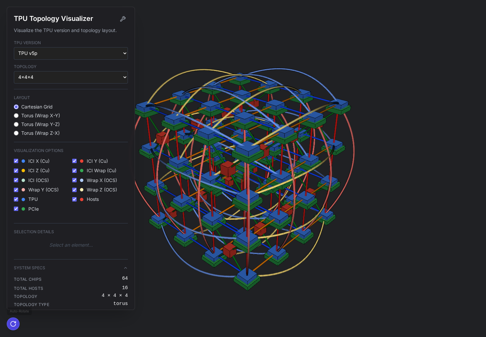
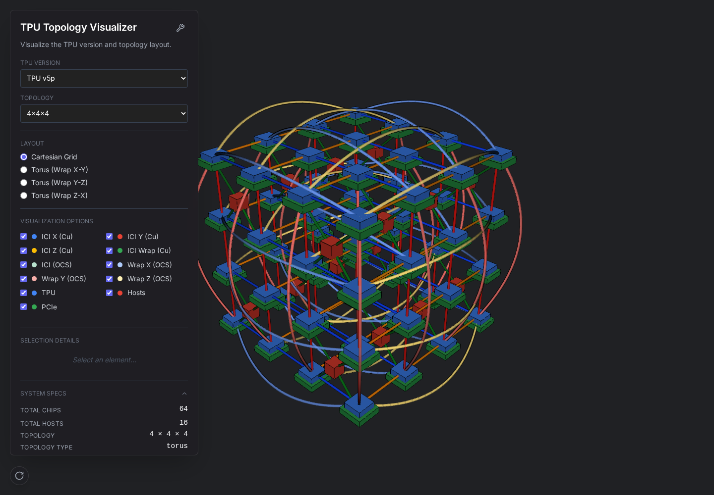
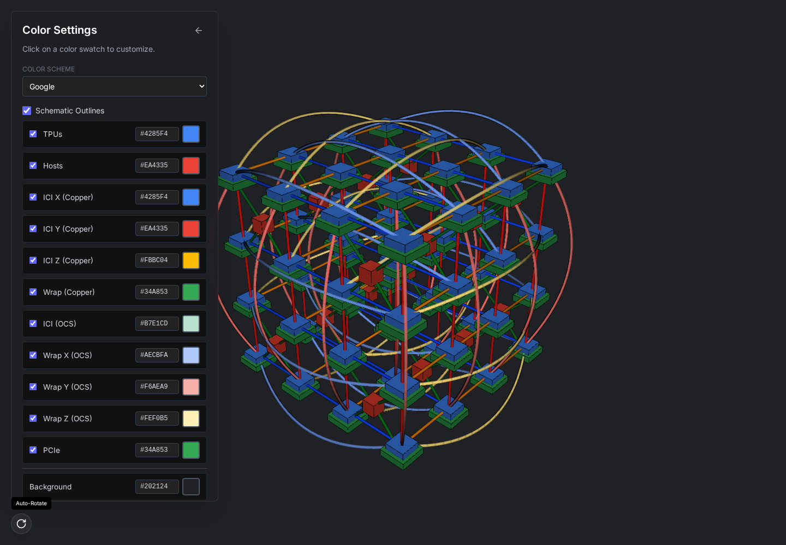
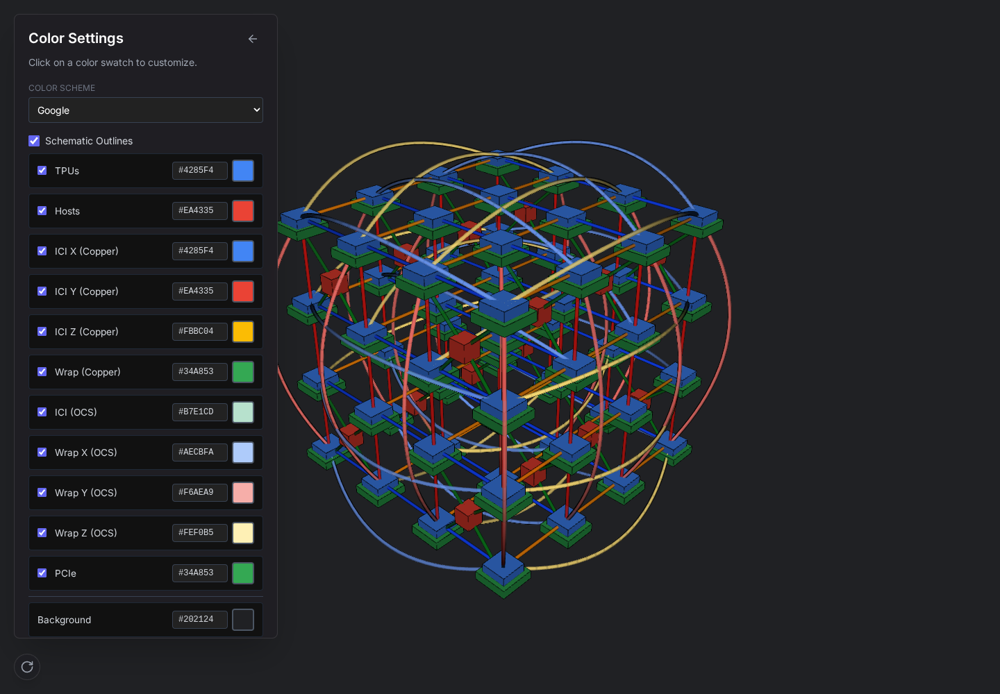
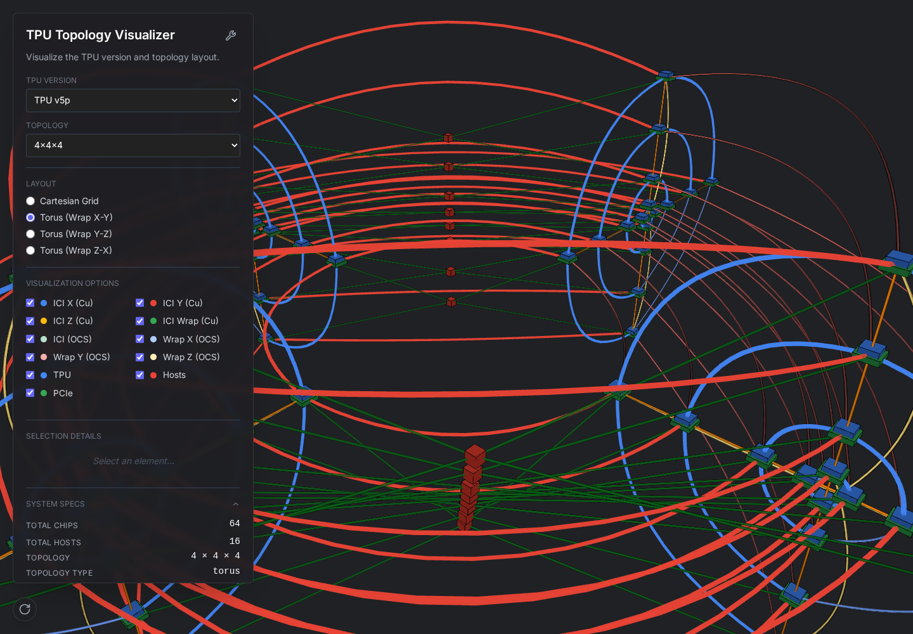
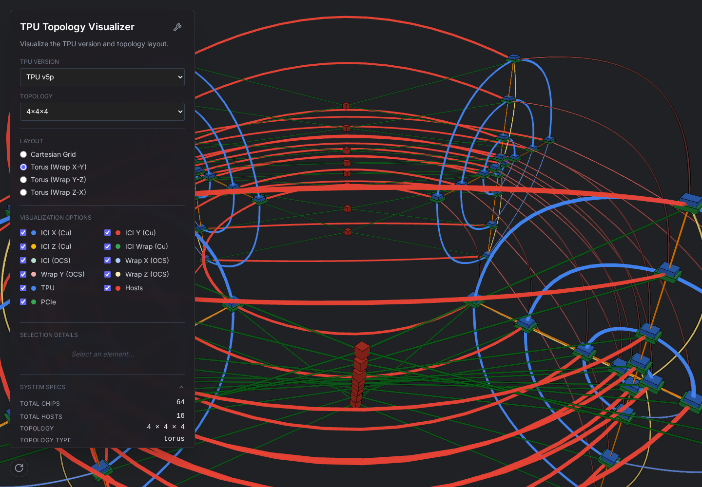

# 实现与验证记录

对照时间：2026-09-08。原站地址：<https://tpu-visualizer.uc.r.appspot.com/>。

## 页面范围

直接使用 Chromium 检查原站主页、配色设置、布局切换、URL 恢复及滚动面板。公开版本只有主面板和配色面板；部署资源中虽然存在其他逻辑，但未在当前公开 UI 中显示的上传、分区编辑等入口不另行添加。

原站 `ntk-data.json` 返回空对象，当前公开面板因此没有工艺、功耗、时钟等扩展规格。复刻显示相同的芯片数、主机数、尺寸和拓扑类型，不补造硬件数据。

## 视觉对照

`reference/layout-measurements.json` 记录 1440 × 1000 视口下两个页面的 DOM 实测位置。面板为 `(20, 20, 380, 900)`，标题为 `(41, 41, 235, 28)`；两组下拉框和四个布局单选框的实测边界完全一致。

| 原站                                                 | 本地                                              |
| ---------------------------------------------------- | ------------------------------------------------- |
|              |              |
|            |            |
|  |  |

截图并非逐像素同一动画帧。场景旋转角度、Three.js 版本的渲染细节和透明几何排序会产生差异；未宣称整页像素差为零。

重新生成参考：`node scripts/inspect-original.mjs`；本地截图：`node scripts/capture-local.mjs`；双站测量：`node scripts/compare.mjs`。这些脚本需开发服务器运行，参考截图脚本另外需要访问原站。

## 当前验证方式

保留 TypeScript 严格检查、Vite 生产构建，以及拓扑连线和逻辑分区的 14 项 Vitest 算法测试。

页面显示、交互和生产页面冒烟测试已删除，同时移除 Playwright Test 配置及 `test:e2e` 命令。上面的截图是复刻阶段的历史对照，截图脚本仅作为手动查看页面的工具保留，不执行测试断言。
